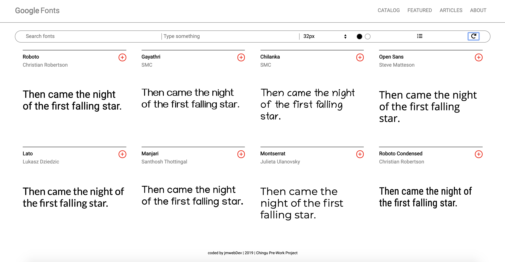

# Chingu Solo Project - Tier 3 - Favorite Fonts

## Overview

This project has been developed with the help of NextJS, Apollo and GraphQL.

## Instructions

Tier 3 **MUST** include a back-end to make the necessary API calls. If desired, you can also add authentication and/or persistence. Use of localStorage, IDB, CacheAPI, etc., are _not_ fill-ins for this project's persistence if you choose to implement the Extra tasks.

General instructions for all Pre-Work Projects can also be found in the Chingu Voyage Handbook (URL posted in the #read-me-first channel on Discord).

**Requirements**

_Structure_

- [x] Header with minor navigation _(Logo and Catalog/Featured/Articles/About link list)_
- [x] Nav with Major navigation / page-manipulation _(search, custom text, font-size, dark/light mode, grid/list mode, and reset)_
- [x] Main section for the font cards
- [x] Font cards which display the Font Name, the sample text, and an add button (the font creator is not available via the api, so it is **not** required in tiers 2 or 3)
- [x] Button that allows user to click and scroll back up to the top _(there could be up to 959 fonts displayed, so you need this!)_
- [x] Footer section with your developer information

_Style_

- [x] Sample text in each card should be displayed in the corresponding font
- [x] Buttons/links should be evident (make sure the cursor changes, etc.)
- [x] Implement a way to handle overflow from sample text in font cards, as the font size is adjustable

_Functionality_

- [x] Text typed into the custom text (type something) box should immediately change the sample text in each font card
- [x] The sample text should return to the default sample if the input box (type something) no longer has any input
- [x] Font size chooser should have at least four sizes and should immediately change the sample text font size in each font card
- [x] Implement the 'reset' icon on the far right of the major navigation; it should reset the page as if it were reloaded _(do not actaully reload the page)_
- [x] On load, the page should display fonts sorted by current popularity, as returned by the Google Fonts Developer API _(see below)_; this call should be server-side
- [x] The search feature should be fully functional and display matching fonts (it's up to you if you want to do this via a 'submit' or through onchange)
- [x] When the search input is cleared (via reset button or manually), the fonts should automaticaly display sorted by poplarity again
- [x] Fonts from the Developer API should be retrieved on the back-end and sent to the client _(see below)_
- [x] StyleSheet requests from the Google Fonts API can be compiled on either the front or the back

_Other_

- [x] Your repo needs to have a robust README.md
- [x] Make sure that there are no errors in the developer console before submitting

**Extras (Not Required)**

- [x] Make your design fully responsive (small/large/portrait/landscape, etc.)
- [ ] Implement the light/dark mode toggle buttons
- [x] Implement the change display icon so you can flip between a grid layout and a list layout for the font cards
- [ ] User creation and authentication: Add a login button to the page that allows registered users to login, or prompts new users to register. Once a user is authenticated, display somewhere on the page that they are logged in.
- [ ] Add a favorites feature with back-end persistence: one example of this would be to use cookies to point to the user's favorite list in your database. You'll need to add a "see favorites" button somewhere to toggle between the view of the user's favorite fonts and the searches / popularity sort.
